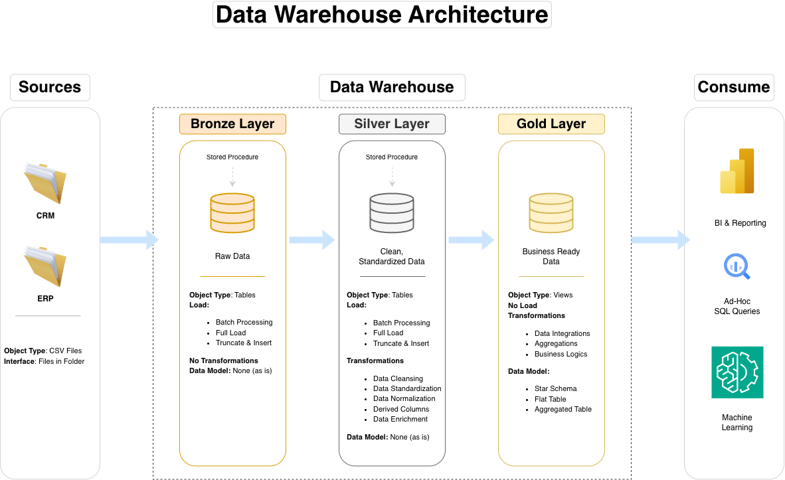
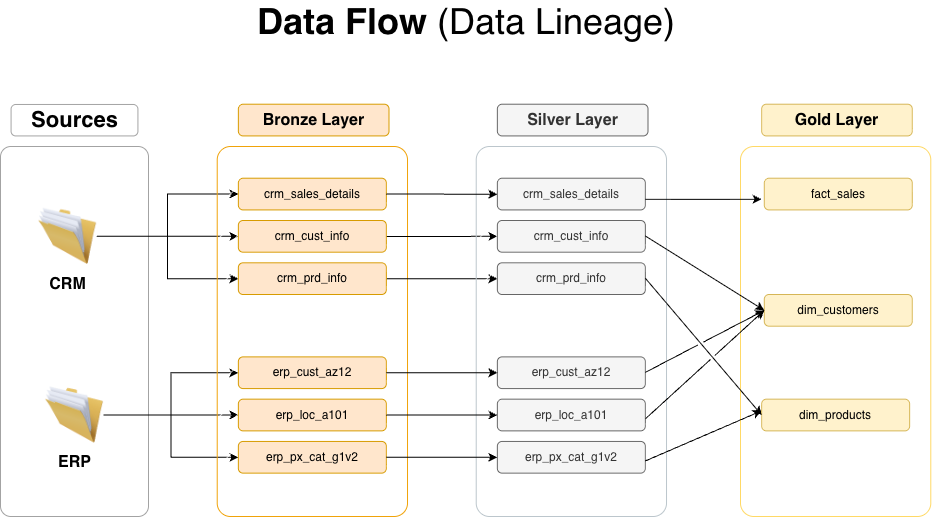
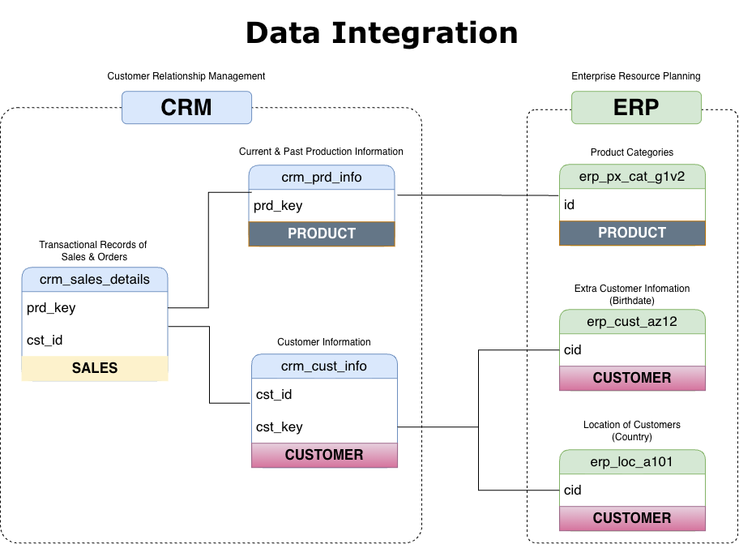
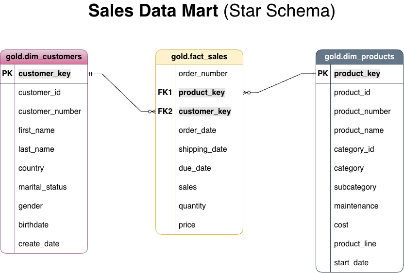

# SQL Data Warehouse · PostgreSQL · Medallion Architecture


An end-to-end data warehouse built in **PostgreSQL**. It ingests customer, product and sales data from two source systems (CRM and ERP), cleans and integrates it through **Bronze → Silver → Gold** layers, and publishes a **star schema** that BI tools and analysts can query directly.


---

## Project at a Glance

| | |
|---|---|
| **Sources** | 2 systems (CRM, ERP) · 6 CSV files |
| **Layers** | Bronze (raw) → Silver (cleaned and standardized) → Gold (star schema) |
| **Gold model** | 1 fact (`fact_sales`, ~60K order lines) · 2 dimensions (`dim_customers`, `dim_products`) |
| **Pipeline** | 2 PL/pgSQL stored procedures that log row counts and load durations |
| **Data quality** | SQL test suites for the Silver and Gold layers |
| **Documentation** | Architecture, data flow, integration and data model diagrams, plus a data catalog |

---

## Business Context

Sales data is split across two operational systems:

- **CRM:** customer master data, product master data and sales transactions
- **ERP:** customer demographics, customer locations and product categories

The two systems use different key formats, different code values and inconsistent data quality. Simple business questions like *who buys what, where and when* require manual reconciliation.

**Goal:** consolidate both sources into one trusted, well-documented data model for analytical reporting.

**Requirements**

- Import data from both source systems (CSV extracts)
- Resolve data quality issues before the data reaches analysts
- Integrate both sources into a single, user-friendly model built for analytical queries
- Keep the latest snapshot only (historization is not required)
- Document the data model for business and analytics users

---

## Architecture



| Layer | Purpose | Object type | Load strategy | Transformations |
|---|---|---|---|---|
| **Bronze** | Raw copy of source data, stored as-is | Tables | Full load (truncate and insert) with `COPY` | None. The raw data stays available for traceability and reprocessing |
| **Silver** | Cleaned, standardized, conformed data | Tables | Full load (truncate and insert) | Deduplication, type casting, standardization, derived columns, `dwh_create_date` audit column |
| **Gold** | Business-ready star schema | Views | None (computed at query time) | CRM + ERP integration, surrogate keys, business-friendly naming |

### Data Flow



### Source Integration



---

## Pipeline Implementation

### 1. Bronze: Ingestion

- `scripts/bronze/ddl_bronze.sql` creates 6 raw tables that mirror the source files, named by source system (`crm_*`, `erp_*`).
- `CALL bronze.load_bronze();` truncates and reloads every table with PostgreSQL `COPY`. For each table and for the whole batch it logs the rows inserted and the load duration (`GET DIAGNOSTICS`, `RAISE NOTICE`).

### 2. Silver: Cleansing and Standardization

`CALL silver.load_silver();` fixes the data quality issues found while profiling the Bronze layer:

| Issue in source data | Treatment |
|---|---|
| Duplicate and null customer IDs | Removed null keys and kept the most recent record per customer (`ROW_NUMBER()`) |
| Leading and trailing spaces in names | Trimmed |
| Cryptic codes (`M`/`S`, `F`/`M`, `R`/`M`/`S`/`T`, `DE`/`US`/`USA`) | Mapped to readable values (e.g. *Married*, *Female*, *Road*, *Germany*). Unknown values become `n/a` |
| Dates stored as integers (`YYYYMMDD`), including `0` and malformed values | Converted to `DATE`. Invalid values become `NULL` |
| Missing, negative or inconsistent sales amounts and prices | Recalculated with the rule `sales = quantity × price` |
| Missing product costs | Defaulted to `0` |
| Unreliable product end dates | Rebuilt as the day before the next version's start date (`LEAD()`) |
| Composite product key | Split into `cat_id` (joins to ERP categories) and `prd_key` (joins to sales) |
| Customer keys that don't match across systems (`NAS` prefix, hyphens) | Cleaned so CRM and ERP records join correctly |
| Birthdates in the future | Set to `NULL` |

### 3. Gold: Star Schema



| Object | Type | Grain | Description |
|---|---|---|---|
| `gold.dim_customers` | Dimension | One row per customer | CRM customer data enriched with ERP birthdate, gender and country |
| `gold.dim_products` | Dimension | One row per current product | CRM products enriched with ERP category, subcategory and maintenance flag. Historical product versions are excluded |
| `gold.fact_sales` | Fact | One row per sales order line | Order, ship and due dates with sales amount, quantity and price, linked to dimensions by surrogate keys |

Column-level definitions are in the **[Data Catalog](docs/data_catalog.md)**.

---

## Data Quality Testing

Each check is a query where **an empty result means the check passed**.

**Silver layer** (`tests/quality_checks_silver.sql`)

- Primary keys are unique and not null
- String fields have no unwanted spaces
- Categorical columns contain only standardized values
- Dates are within valid ranges and in logical order (order date ≤ ship date and due date)
- `sales = quantity × price` holds for every row
- Birthdates are within a realistic range

**Gold layer** (`tests/quality_checks_gold.sql`)

- Surrogate keys are unique in each dimension
- Referential integrity: every fact row links to a customer and a product

---

## Key Design Decisions

| Decision | Rationale |
|---|---|
| **Full load (truncate and insert)** | Sources are small batch extracts and only the latest snapshot is required. A full refresh is simple and gives the same result every time it runs. |
| **Keep Bronze raw** | Preserves the original source data for debugging, auditing and reprocessing without extracting it again. |
| **Gold as views** | Always in sync with Silver, with no extra storage or load step. The trade-off is compute at query time, so views could be materialized as data volumes grow. |
| **CRM is the source of truth for gender** | When CRM has no value, the model falls back to ERP. This is an explicit, documented rule for handling conflicting attributes. |
| **Surrogate keys in dimensions** | Decouple the analytical model from source system identifiers. |
| **Consistent naming conventions** | `<source>_<entity>` in Bronze and Silver, `dim_` and `fact_` prefixes in Gold, and snake_case business-friendly column names. |

---

## PostgreSQL Implementation

This project uses **PostgreSQL**:

- Rewriting the load procedures in **PL/pgSQL** (`CREATE OR REPLACE PROCEDURE`, `CALL`)
- Replacing `BULK INSERT` with `COPY ... WITH (FORMAT CSV, HEADER TRUE)`
- Translating T-SQL idioms to PostgreSQL: `PRINT` → `RAISE NOTICE`, `GETDATE()` → `clock_timestamp()` / `CURRENT_TIMESTAMP`, `LEN()` → `LENGTH()`, `ISNULL()` → `COALESCE()`, `IF OBJECT_ID(...)` → `DROP ... IF EXISTS`, and integer-to-date conversion with `TO_DATE()`
- Adding **row-count logging** for each table with `GET DIAGNOSTICS`
- Getting around macOS privacy (TCC) restrictions on server-side `COPY` by placing the source files in `/Users/Shared`

---

## Repository Structure

```
sql-data-warehouse/
├── datasets/
│   ├── source_crm/                  # cust_info, prd_info, sales_details (CSV)
│   └── source_erp/                  # CUST_AZ12, LOC_A101, PX_CAT_G1V2 (CSV)
├── docs/
│   ├── data_architecture.png        # Medallion architecture overview
│   ├── data_flow.png                # Lineage from sources to Gold
│   ├── data_integration.png         # How CRM and ERP tables relate
│   ├── data_model.png               # Star schema
│   └── data_catalog.md              # Gold layer column definitions
├── scripts/
│   ├── init_database.sql            # Database and schema setup
│   ├── bronze/                      # DDL and load procedure (source → Bronze)
│   ├── silver/                      # DDL and load procedure (Bronze → Silver)
│   └── gold/                        # Star schema views
├── tests/
│   ├── quality_checks_silver.sql
│   └── quality_checks_gold.sql
└── README.md
```

---

## Skills Demonstrated

- **Data modeling:** dimensional modeling (star schema), defining grain, surrogate keys
- **Data pipelines:** layered ETL with SQL and PL/pgSQL stored procedures
- **Data cleansing:** deduplication, standardization, type conversion, business-rule validation
- **Advanced SQL:** window functions (`ROW_NUMBER`, `LEAD`), subqueries, conditional logic, joins across source systems
- **Data quality:** testing for key integrity, consistency and referential integrity
- **Documentation:** architecture diagrams, data lineage and a data catalog


